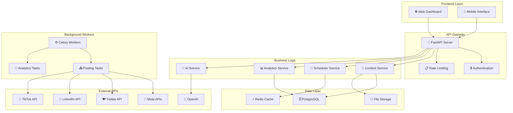

<div align="center">

# 🤖 Automated Marketing Agent

*A comprehensive AI-powered marketing automation platform for multi-platform social media management*

[](https://python.org)
[](https://fastapi.tiangolo.com)
[](https://docker.com)
[](LICENSE)

[](https://github.com/yourusername/automated-marketing-agent/stargazers)
[](https://github.com/yourusername/automated-marketing-agent/network/members)
[](https://github.com/yourusername/automated-marketing-agent/issues)

</div>

## 📋 Table of Contents

- [🌟 Demo & Screenshots](#-demo--screenshots)
- [✨ Key Features](#-key-features)
- [🚀 Quick Start](#-quick-start)
- [🔑 API Configuration](#-api-configuration)
- [🐳 Docker Commands](#-docker-commands)
- [📱 Access Points](#-access-points)
- [🏗️ System Architecture](#️-system-architecture)
- [🛠️ Technology Stack](#️-technology-stack)
- [📋 Core Components](#-core-components)
- [📁 Project Structure](#-project-structure)
- [🚦 Getting Started Guide](#-getting-started-guide)
- [🔧 Development](#-development)
- [📊 Monitoring & Maintenance](#-monitoring--maintenance)
- [🗺️ Roadmap](#️-roadmap)
- [🤝 Contributing](#-contributing)
- [📄 License](#-license)
- [🆘 Support & Community](#-support--community)
- [🧪 Testing](#-testing)

## 🌟 Demo & Screenshots

<div align="center">


*Modern, intuitive dashboard for managing all your marketing campaigns*

</div>

| Feature | Preview |
|---------|---------|
| 📊 **Analytics Dashboard** | Real-time metrics and performance insights |
| 🎨 **Content Studio** | AI-powered content generation and editing |
| 📅 **Campaign Manager** | Multi-platform scheduling and automation |
| 🔒 **Security Center** | Encrypted credentials and access controls |

## ✨ Key Features

<div align="center">

| 🎯 **AI-Powered** | 📅 **Multi-Platform** | 📊 **Analytics** | 🔒 **Secure** |
|:-----------------:|:---------------------:|:----------------:|:--------------:|
| OpenAI GPT integration for content generation | Instagram, Facebook, LinkedIn, Twitter, TikTok | Real-time engagement tracking | Encrypted credentials & compliance |
| Smart optimization algorithms | Unified posting interface | Performance insights & ROI | Role-based access controls |
| Brand voice consistency | Cross-platform campaigns | Trend analysis & recommendations | GDPR-compliant data handling |

</div>

### 🚀 Core Capabilities

- **🤖 AI Content Generation** - Create engaging posts using OpenAI GPT models with brand-specific training
- **📱 Multi-Platform Publishing** - Seamlessly post to Instagram, Facebook, LinkedIn, Twitter, and TikTok
- **📈 Advanced Analytics** - Track engagement, reach, and ROI with detailed performance metrics
- **⚡ Smart Automation** - Rule-based workflows and optimal timing algorithms
- **🎨 Brand Management** - Maintain consistent voice, style, and messaging across all platforms
- **🔐 Enterprise Security** - Military-grade encryption and compliance-ready infrastructure  

## 🚀 Quick Start

<div align="center">

**Get up and running in under 5 minutes!**

</div>

### 🐳 Option 1: Docker (Recommended)

```bash
# 📥 Clone the repository
git clone https://github.com/yourusername/automated-marketing-agent.git
cd automated-marketing-agent

# 🔧 Interactive setup (handles everything)
./setup.sh

# 🚀 Quick start (if already configured)
./start.sh
```

### 💻 Option 2: Local Development

```bash
# 🐍 Create virtual environment
python -m venv venv
source venv/bin/activate  # Windows: venv\Scripts\activate

# 📦 Install dependencies
pip install -r requirements.txt

# ⚙️ Configure environment
cp .env.example .env
# Edit .env with your API keys

# 🗄️ Initialize database
alembic upgrade head
python -m app.core.init_db

# 🌐 Start server
uvicorn app.main:app --reload
```

> 💡 **Pro Tip**: Use `./setup.sh` for guided configuration or `python configure_api_keys.py` for API key management.

## 🔑 API Configuration

### Required
- **OpenAI API Key** - Get from [OpenAI Platform](https://platform.openai.com/api-keys)

### Optional (Enable platform-specific features)
- **Facebook/Instagram** - [Meta Developers](https://developers.facebook.com/)
- **Twitter/X** - [Twitter Developer Portal](https://developer.twitter.com/)
- **LinkedIn** - [LinkedIn Developers](https://www.linkedin.com/developers/)
- **TikTok** - [TikTok Developers](https://developers.tiktok.com/)

```bash
# Interactive configuration helper
python configure_api_keys.py
```

## 🐳 Docker Commands

```bash
make help            # Show all commands
make up              # Start all services
make dev             # Development mode
make logs            # View logs
make down            # Stop services
make shell           # Access container
make clean           # Clean resources
```

## 📱 Access Points

| Service | URL | Description |
|---------|-----|-------------|
| 🏠 **Main App** | http://localhost:8000 | Dashboard & Interface |
| 📚 **API Docs** | http://localhost:8000/docs | Interactive API Documentation |
| 🔍 **ReDoc** | http://localhost:8000/redoc | Alternative API Documentation |
| ❤️ **Health** | http://localhost:8000/health | Service Health Status |

## 🏗️ System Architecture

<div align="center">



**Scalable microservices architecture with async processing and real-time analytics**

</div>

## �️ Technology Stack

<div align="center">

| **Backend** | **Frontend** | **Database** | **DevOps** | **AI/ML** |
|:-----------:|:------------:|:------------:|:----------:|:---------:|
|  |  |  |  |  |
|  |  |  |  |  |
|  |  |  |  |  |

</div>

## 📋 Core Components
- **Centralized Repository** - Store and organize all marketing content
- **AI Content Generation** - Create posts using OpenAI GPT models  
- **Brand Guidelines** - Maintain consistent voice and style
- **Media Library** - Support for images, videos, and rich media

### 📅 Scheduling & Automation
- **Multi-Platform Publishing** - Post to all major social platforms
- **Smart Scheduling** - Optimal timing based on audience engagement
- **Campaign Management** - Organize content into targeted campaigns
- **Automated Workflows** - Rule-based posting sequences

### 📊 Analytics & Insights
- **Real-Time Metrics** - Track engagement as it happens
- **Performance Reports** - Detailed analytics and ROI calculations
- **AI Recommendations** - Data-driven optimization suggestions
- **Trend Analysis** - Identify what content performs best

### � Security & Compliance
- **Encrypted Storage** - Secure credential and data management
- **Access Controls** - Role-based permissions and audit trails
- **Privacy Protection** - GDPR-compliant data handling
- **API Security** - Rate limiting and authentication

## 📁 Project Structure

<details>
<summary><strong>📂 Click to expand project structure</strong></summary>

```
automated-marketing-agent/
├── 🐳 Docker Configuration
│   ├── Dockerfile                 # Production container image
│   ├── docker-compose.yml         # Production orchestration
│   ├── docker-compose.dev.yml     # Development environment
│   └── .dockerignore              # Docker build exclusions
│
├── 🚀 Application Core
│   └── app/
│       ├── 🌐 api/v1/             # REST API endpoints
│       │   └── endpoints/         # Route handlers
│       ├── 🔧 core/               # Configuration & database
│       │   ├── config.py          # Environment settings
│       │   ├── database.py        # Database connection
│       │   ├── security.py        # Authentication
│       │   └── celery.py          # Background tasks
│       ├── 📊 models/             # SQLAlchemy models
│       │   ├── user.py            # User & authentication
│       │   └── content.py         # Content & campaigns
│       ├── 🎯 services/           # Business logic
│       │   ├── ai_service.py      # OpenAI integration
│       │   └── social_platforms.py # Platform APIs
│       └── ⚙️ tasks/              # Celery background jobs
│           ├── content_tasks.py   # Content generation
│           └── posting_tasks.py   # Social media posting
│
├── 🗄️ Database & Migrations
│   ├── migrations/                # Alembic database migrations
│   │   └── versions/              # Migration scripts
│   ├── alembic.ini               # Migration configuration
│   └── init-db.sql               # Database initialization
│
├── ⚙️ Configuration & Setup
│   ├── .env.example              # Environment template
│   ├── requirements.txt          # Production dependencies
│   ├── requirements-minimal.txt  # Minimal dependencies
│   ├── setup.sh                  # Interactive setup script
│   ├── configure_api_keys.py     # API key configuration
│   └── Makefile                  # Development commands
│
└── 📚 Documentation
    ├── README.md                  # This file
    ├── DOCKER.md                  # Docker deployment guide
    └── DEVELOPMENT_STATUS.md      # Development progress
```

</details>

## 🚦 Getting Started Guide

<div align="center">

**🎯 Complete setup in 5 simple steps**

</div>

### 📋 Prerequisites

<table>
<tr>
<td align="center">🐳</td>
<td><strong>Docker & Docker Compose</strong><br/>
<em>Recommended for easy deployment</em><br/>
<a href="https://docs.docker.com/get-docker/">Get Docker →</a></td>
</tr>
<tr>
<td align="center">🐍</td>
<td><strong>Python 3.11+</strong><br/>
<em>For local development</em><br/>
<a href="https://python.org/downloads/">Download Python →</a></td>
</tr>
<tr>
<td align="center">🔑</td>
<td><strong>API Keys</strong><br/>
<em>From platforms you want to use</em><br/>
<a href="#-api-configuration">Configuration Guide →</a></td>
</tr>
</table>

### 🛠️ Installation Steps

#### Step 1: Clone Repository
```bash
git clone https://github.com/yourusername/automated-marketing-agent.git
cd automated-marketing-agent
```

#### Step 2: Choose Your Setup Method

<table>
<tr>
<th>🐳 Docker (Recommended)</th>
<th>💻 Local Development</th>
</tr>
<tr>
<td>

```bash
# Interactive setup
./setup.sh

# Manual setup
cp .env.example .env
# Edit .env file
docker-compose up -d
```

</td>
<td>

```bash
# Create virtual environment
python -m venv venv
source venv/bin/activate

# Install dependencies
pip install -r requirements.txt

# Setup database
cp .env.example .env
# Edit .env file
alembic upgrade head
python -m app.core.init_db
```

</td>
</tr>
</table>

#### Step 3: Configure API Keys
```bash
# Interactive configuration
python configure_api_keys.py

# Or manually edit .env
nano .env
```

#### Step 4: Launch Application
```bash
# Docker
make up

# Local
uvicorn app.main:app --reload
```

#### Step 5: Access Dashboard
Open your browser to **http://localhost:8000** 🎉

### 🎯 First Steps Checklist

- [ ] 📝 Create your first client/brand profile
- [ ] 🔗 Connect social media accounts  
- [ ] 🎨 Generate your first AI content
- [ ] 📅 Schedule your first post
- [ ] 📊 Review analytics dashboard

## 🔧 Development

### Local Development Setup
```bash
# Install dependencies
pip install -r requirements.txt

# Setup pre-commit hooks (optional)
pre-commit install

# Run tests
pytest

# Start development server
uvicorn app.main:app --reload --port 8000
```

### Docker Development
```bash
# Start development environment
make dev

# Access container shell
make shell

# View logs
make logs

# Run migrations
make migrate
```

## 📊 Monitoring & Maintenance

### Health Checks
```bash
# Application health
curl http://localhost:8000/health

# Service status
make status
```

### Logs & Debugging
```bash
# View all logs
make logs

# Specific service logs
docker-compose logs -f api
docker-compose logs -f worker
```

### Backup & Recovery
```bash
# Database backup
docker-compose exec postgres pg_dump -U marketing_admin marketing_agent > backup.sql

# Restore database
docker-compose exec -T postgres psql -U marketing_admin marketing_agent < backup.sql
```

## 🗺️ Roadmap

<div align="center">

**🚀 Exciting features coming soon!**

</div>

### ✅ Current Features (v1.0)
- ✅ Multi-platform social media posting
- ✅ AI-powered content generation
- ✅ Basic analytics and reporting
- ✅ Campaign management
- ✅ User authentication and security
- ✅ Docker deployment

### 🚧 In Development (v1.1)
- 🔄 Advanced automation workflows
- 📈 Enhanced analytics dashboard
- 🎨 Visual content editor
- 📱 Mobile app companion
- 🔔 Real-time notifications

### 🎯 Planned Features (v2.0)
- 🤖 Advanced AI recommendations
- 🎥 Video content support
- 📊 Custom reporting builder
- 🌍 Multi-language support
- 🔗 CRM integrations
- ☁️ Cloud storage integrations

### 💭 Future Vision (v3.0+)
- 🧠 Predictive analytics
- 🎪 Interactive content creation
- 🌐 Multi-tenant SaaS platform
- 📱 Native mobile apps
- 🤝 Influencer collaboration tools

> 💡 **Have ideas?** [Share your feature requests](https://github.com/yourusername/automated-marketing-agent/discussions) with the community!

## 🤝 Contributing

<div align="center">

**We ❤️ contributions! Join our community of developers building the future of marketing automation.**

[](https://github.com/yourusername/automated-marketing-agent/graphs/contributors)
[](https://github.com/yourusername/automated-marketing-agent/pulls)

</div>

### 🚀 How to Contribute

1. **🍴 Fork** the repository
2. **🌿 Create** a feature branch
   ```bash
   git checkout -b feature/amazing-feature
   ```
3. **✨ Make** your changes
4. **🧪 Test** your changes
   ```bash
   pytest
   ```
5. **📝 Commit** your changes
   ```bash
   git commit -m 'Add amazing feature'
   ```
6. **🚀 Push** to your branch
   ```bash
   git push origin feature/amazing-feature
   ```
7. **📬 Open** a Pull Request

### 🎯 Areas We Need Help

| Area | Skills Needed | Difficulty |
|------|---------------|------------|
| 🤖 **AI Integrations** | Python, OpenAI API, Machine Learning | 🟡 Medium |
| 🌐 **Frontend Development** | React, TypeScript, Tailwind CSS | 🟢 Easy |
| 📱 **Social Media APIs** | REST APIs, OAuth, Platform SDKs | 🟡 Medium |
| 🔒 **Security & Compliance** | Cybersecurity, GDPR, Encryption | 🔴 Hard |
| 📊 **Analytics & Reporting** | Data Science, Visualization, SQL | 🟡 Medium |
| 📚 **Documentation** | Technical Writing, Markdown | 🟢 Easy |

### 📋 Development Guidelines

- **Code Style**: Follow PEP 8 for Python, ESLint for JavaScript
- **Testing**: Write tests for new features (aim for 80%+ coverage)
- **Documentation**: Update docs for any API changes
- **Commits**: Use conventional commit messages
- **Reviews**: All PRs require at least one review

### 🏆 Recognition

Contributors will be:
- ⭐ Listed in our contributors section
- 🎖️ Featured in release notes
- 🏅 Eligible for our contributor recognition program

## 📄 License

This project is licensed under the **MIT License** - see the [LICENSE](LICENSE) file for details.

```
MIT License - Feel free to use this project for personal or commercial purposes!
```

## 🆘 Support & Community

<div align="center">

**Need help? We're here for you!**

</div>

<table>
<tr>
<td align="center">📖</td>
<td><strong>Documentation</strong><br/>
Comprehensive guides and API docs<br/>
<a href="docs/">� Browse Docs →</a></td>
</tr>
<tr>
<td align="center">🐛</td>
<td><strong>Bug Reports</strong><br/>
Found a bug? Let us know!<br/>
<a href="https://github.com/yourusername/automated-marketing-agent/issues">🔍 Report Issue →</a></td>
</tr>
<tr>
<td align="center">💬</td>
<td><strong>Discussions</strong><br/>
Questions, ideas, and community chat<br/>
<a href="https://github.com/yourusername/automated-marketing-agent/discussions">💭 Join Discussion →</a></td>
</tr>
<tr>
<td align="center">📧</td>
<td><strong>Direct Support</strong><br/>
For enterprise and priority support<br/>
<a href="mailto:support@yourcompany.com">📩 Contact Us →</a></td>
</tr>
</table>

### 🌟 Community

- 💻 **Discord**: [Join our developer community](https://discord.gg/yourserver)
- 🐦 **Twitter**: [@YourHandle](https://twitter.com/yourhandle) - Follow for updates
- 📺 **YouTube**: [Tutorial videos and demos](https://youtube.com/yourchannel)
- 📝 **Blog**: [Development updates and tutorials](https://yourblog.com)

## ⭐ Show Your Support

<div align="center">

**If this project helped you, please consider:**

[](https://github.com/yourusername/automated-marketing-agent)
[](https://github.com/yourusername)
[](https://twitter.com/intent/tweet?text=Check%20out%20this%20amazing%20AI-powered%20marketing%20automation%20tool!&url=https://github.com/yourusername/automated-marketing-agent)

**Every ⭐ helps us grow and improve!**

</div>

---

<div align="center">

### 🚀 **Built with ❤️ for modern marketing teams**

**[🏠 Homepage](https://yourwebsite.com)** • **[📖 Documentation](docs/)** • **[🎯 Roadmap](#-roadmap)** • **[🤝 Contributing](#-contributing)**

<sub>Made with ❤️ by the **Automated Marketing Agent** team</sub>

</div>

## 🧪 Testing

<div align="center">

**Comprehensive test suite with unit, integration, security, and performance tests**

</div>

### 🚀 Quick Test Commands

```bash
# Run all tests
make test

# Run specific test types
make test-unit          # Unit tests only
make test-integration   # Integration tests only
make test-security      # Security tests only
make test-performance   # Performance tests only

# Coverage and reporting
make test-coverage      # Generate coverage report
make test-watch         # Watch mode for development
make test-docker        # Run tests in Docker
```

### 📋 Test Categories

| Test Type | Description | Command |
|-----------|-------------|---------|
| 🔬 **Unit Tests** | Fast, isolated component tests | `./run_tests.sh unit` |
| 🔗 **Integration Tests** | End-to-end API workflow tests | `./run_tests.sh integration` |
| 🔒 **Security Tests** | Security scanning and vulnerability checks | `./run_tests.sh security` |
| ⚡ **Performance Tests** | Load testing and performance benchmarks | `./run_tests.sh performance` |

### 🎯 Test Coverage

Our test suite covers:
- ✅ **API Endpoints** - All REST API routes and responses
- ✅ **Authentication** - User registration, login, and JWT tokens
- ✅ **Content Management** - CRUD operations and validation
- ✅ **AI Integration** - OpenAI service and content generation
- ✅ **Database Operations** - Models, relationships, and migrations
- ✅ **Security** - Input validation, authentication, and authorization
- ✅ **Error Handling** - Edge cases and error scenarios

### 🔧 Test Setup

For local testing:
```bash
# Install test dependencies
pip install pytest pytest-cov pytest-asyncio pytest-mock httpx

# Run tests with coverage
pytest --cov=app --cov-report=html

# View coverage report
open htmlcov/index.html
```

For Docker testing:
```bash
# Run complete test suite in Docker
make test-docker

# Or manually
docker-compose -f docker-compose.test.yml up --build
```

### 📊 Continuous Integration

Tests run automatically on:
- 🔄 **Every Push** - GitHub Actions workflow
- 📝 **Pull Requests** - Automated PR testing
- 🌙 **Nightly** - Scheduled comprehensive testing
- 🏷️ **Releases** - Full test suite validation

View test results and coverage reports in the [GitHub Actions](https://github.com/yourusername/automated-marketing-agent/actions) tab.

## 🔧 Development
